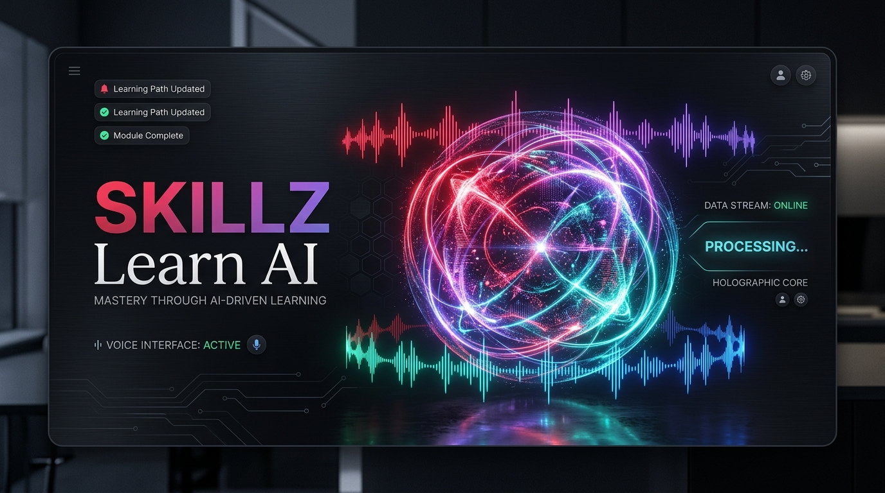
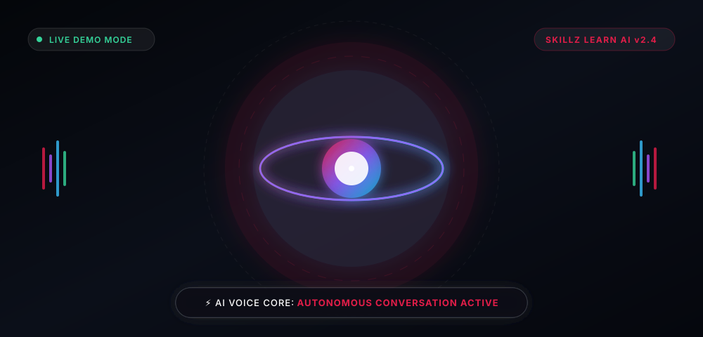
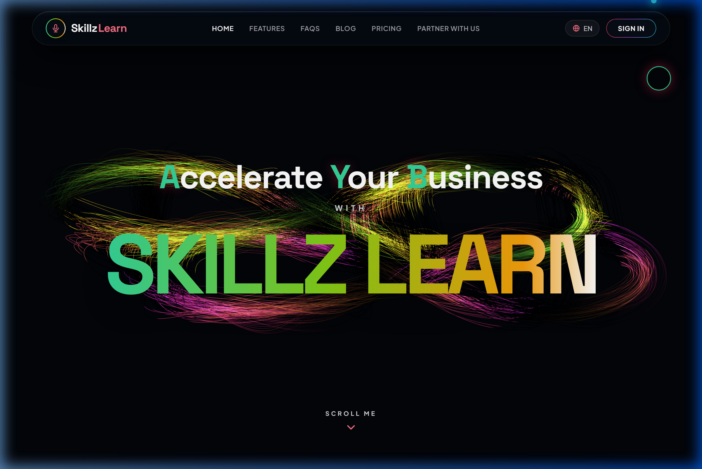
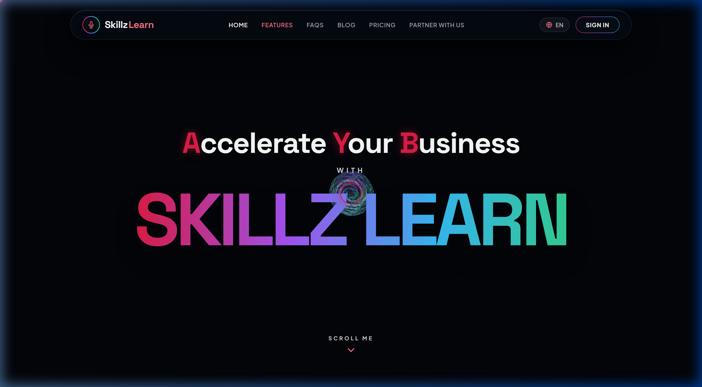

# 🚀 Skillz Learn AI — Autonomous AI Voice Agents for Business

<div align="center">

  

  <br />

  [](https://tharunmtb-racer21.github.io/startup-company-project/)
  [](https://react.dev/)
  [](https://threejs.org/)
  [](https://tailwindcss.com/)
  [](https://www.typescriptlang.org/)
  [](./LICENSE)

  <br />

  ### 🌐 **Live Demo Application**: [https://tharunmtb-racer21.github.io/startup-company-project/](https://tharunmtb-racer21.github.io/startup-company-project/)

</div>

---

## 📽️ Interactive 3D Core Animation

<div align="center">
  
  <p><i>Live interactive 3D particle sphere and dynamic ambient waveform loop.</i></p>
</div>

---

## 🌟 Overview

**Skillz Learn AI** is a state-of-the-art web application showcasing **Autonomous AI Voice Agents for Enterprise & Business**. Built with **React 19, Three.js, TypeScript, and Tailwind CSS v4**, the application features an immersive **interactive 3D canvas**, real-time audio waveform visualizers, dynamic theme switching, glassmorphic UI cards, and responsive micro-interactions.

### ✨ Key Features

- **🌐 Interactive 3D Holographic Core**: 3D mesh particle node rendered using Three.js with fluid camera damping, rotational inertia drag, and ambient pulse breathing.
- **🎨 Dynamic Theme Engine**: Switch between 4 curated neon color presets (**Ruby Red**, **Zen Violet**, **Electric Cyan**, **Hyper Emerald**) that instantly mutate 3D shaders, glows, borders, and CSS variables.
- **🎙️ Real-time Audio Visualizer**: Interactive audio player equipped with live animated frequency spectrum bars and voice pitch controls.
- **⚡ Sub-100ms Latency UI**: Built on Vite 8 for blazing-fast speed and instant rendering.
- **💎 Glassmorphic Modern Aesthetic**: Premium dark-mode interface with subtle neon backlights, custom cursor tracking, and fluid Framer Motion state transitions.
- **📱 Fully Responsive**: Optimized across desktop, tablet, and mobile displays.

---

## 📸 Interface Screenshots

<div align="center">
  <h3>Hero & 3D Interactive Canvas</h3>
  
  <br/><br/>
  <h3>Features & Autonomous Capabilities Showcase</h3>
  
</div>

---

## 🛠️ Tech Stack

| Category | Technology | Description |
| :--- | :--- | :--- |
| **Frontend Core** | **React 19** & **TypeScript** | Component architecture & strict type safety |
| **3D & Graphics** | **Three.js** / **R3F** / **Drei** | Interactive 3D WebGL scenes, particle physics & materials |
| **Styling** | **Tailwind CSS v4** | Utility-first styling & custom CSS glassmorphism variables |
| **Animations** | **Framer Motion** & **SVG Motion** | Smooth UI transitions & interactive micro-animations |
| **Icons & UI** | **Lucide React** | Modern iconography set |
| **Build System** | **Vite 8** | Ultra-fast development server & production bundler |

---

## 📂 Project Structure

```bash
startup-company-project/
├── assets/                  # High-resolution screenshots, banners & SVG animations
│   ├── banner.jpg           # 3D Holographic Hero Banner
│   ├── demo.svg             # Animated 3D Core SVG Loop
│   ├── hero-preview.png     # Full-screen desktop preview screenshot
│   └── features-preview.png # Features grid preview screenshot
├── public/                  # Static assets & favicon
├── src/                     # React application source code
│   ├── components/          # 3D Scene components & Overlay UI
│   │   ├── scene/           # ProductCore, ProductLighting, CameraRig, Particles
│   │   └── ui/              # Overlay UI, Control dock, Status bar
│   ├── App.tsx              # Main application wrapper
│   └── main.tsx             # Entry point
├── index.html               # Main HTML entry with embedded 3D showcase
├── package.json             # Dependencies & build scripts
├── tsconfig.json            # TypeScript configuration
└── vite.config.ts           # Vite build configuration
```

---

## 🚀 Quick Start Guide

Follow these steps to set up and run the project locally on your machine:

### Prerequisites

Ensure you have **Node.js 18+** and **npm** installed.

### 1. Clone the Repository

```bash
git clone https://github.com/Tharunmtb-racer21/startup-company-project.git
cd startup-company-project
```

### 2. Install Dependencies

```bash
npm install
```

### 3. Run Development Server

```bash
npm run dev
```

Open [http://localhost:5173](http://localhost:5173) in your browser to view the live app.

### 4. Build for Production

```bash
npm run build
```

The optimized production bundle will be generated in the `dist/` directory.

---

## 🌐 Deployment

This project is deployed live on **GitHub Pages**. 

You can view the deployed application here:  
👉 **[https://tharunmtb-racer21.github.io/startup-company-project/](https://tharunmtb-racer21.github.io/startup-company-project/)**

To deploy updates to GitHub Pages:
1. Commit all code changes to the `main` branch.
2. Ensure GitHub Pages is set to build from `main` root in repository settings.

---

## 🤝 Contributing

Contributions, issues, and feature requests are welcome!  
Feel free to check the [issues page](https://github.com/Tharunmtb-racer21/startup-company-project/issues).

---

## 📄 License

This project is licensed under the **MIT License** — see the [LICENSE](./LICENSE) file for details.

<div align="center">
  <sub>Built with ❤️ for AI Voice Innovation</sub>
</div>
